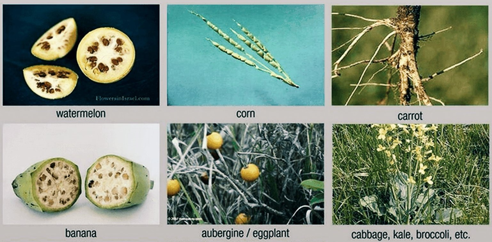
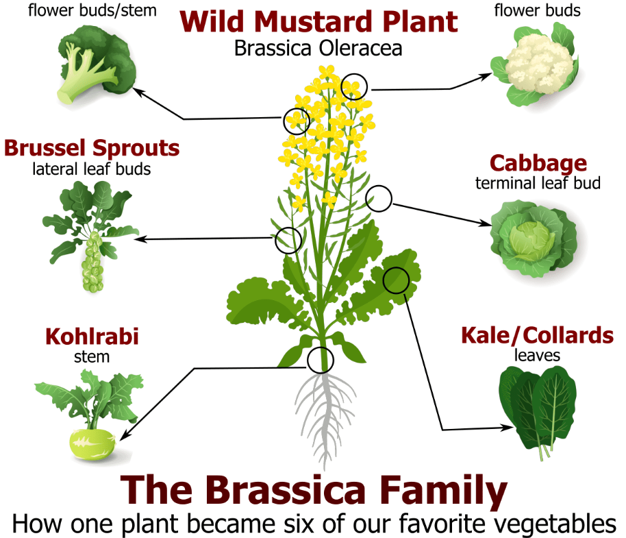
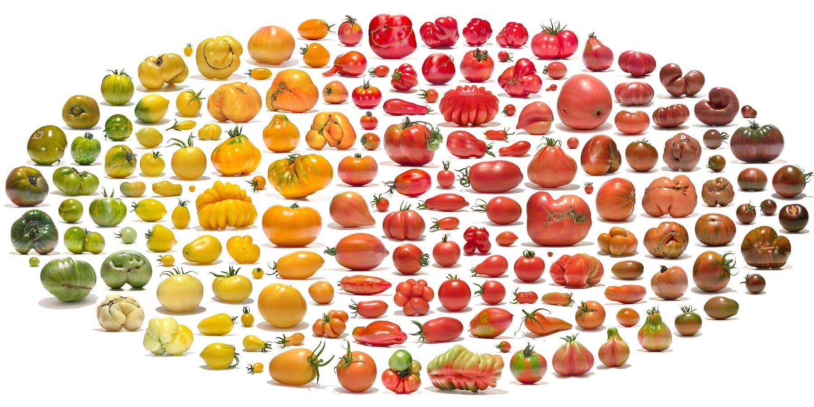
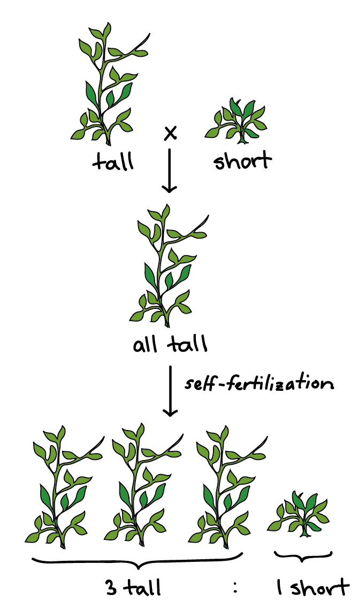
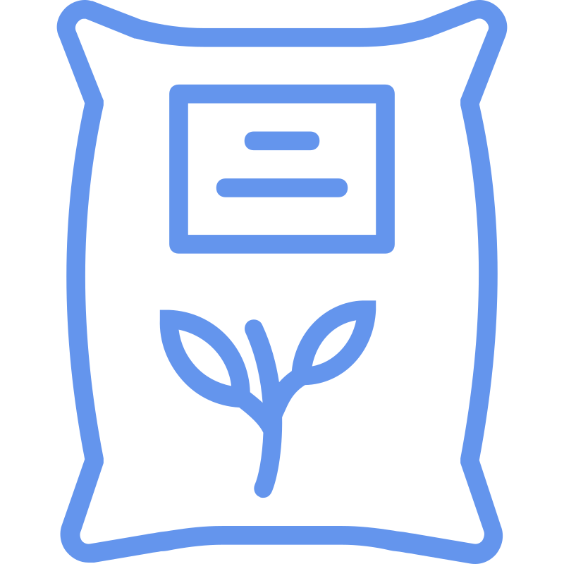
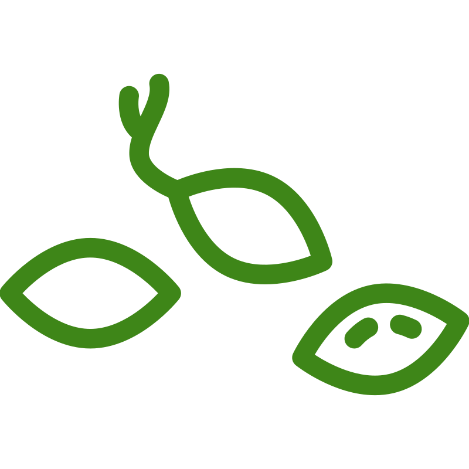
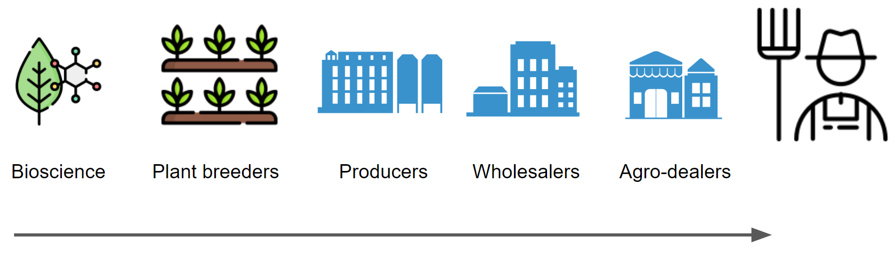
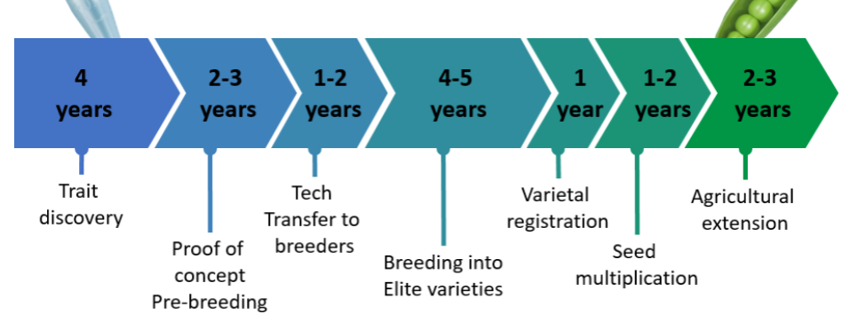
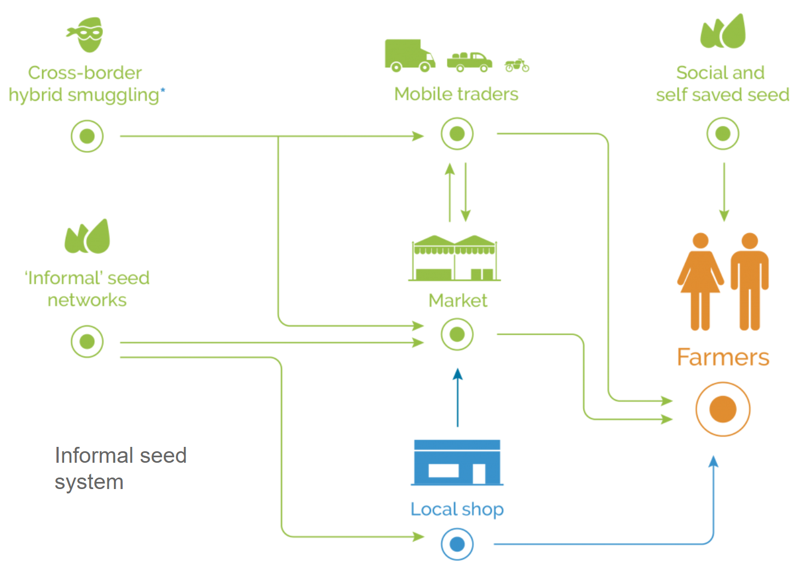
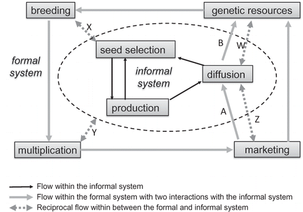

---
# You can also start simply with 'default'
theme: seriph
# see https://nisd.ac.uk/wp-content/uploads/2019/06/IMG_9612-smaller.jpg
background: ./assets/images/seedsentrybagb.jpg
# some information about your slides (markdown enabled)
title: Seed system intro
info: |
  ## Seed system overview
class: text-center
drawings:
  persist: false
transition: slide-left
mdc: true
contextMenu: false
---

# Quick seed systems overview

 <strong>Dr Matt Heaton</strong>   Norwich Institute for Sustainable Development

<!--
Hello everyone, it's a pleasure.
-->

---
layout: image-left

image: ./assets/images/hunt-gath.png

class: hunt_gath
---

### Pathway to agriculture today

<v-clicks depth='2'>

* Develops about 12,000 years ago in a shift from hunter-gather communities
* Crops:
  * Neolithic founder crops: bitter vetch, chickpeas, emmer wheat, einkorn wheat, flax, hulled barley, peas & lentils 
  * China: Rice, azuki, mung, soy beans
  * Africa:  African rice, black eyed pea, coffee, cowpeas, finger millet, ensete, noog, okra pearl millet, plantains, sorghum, teff, watermelon & yams.
  * South America:  Beans, cassava, chilli, cotton, maize, peanuts, squash & tomatoes.

</v-clicks>

---
layout: center
---

## Our crops today are the result of long-term selection

---
layout: center
---

---
layout: center
---

---
layout: statement
class: px-45
---

## "Variety"

A **variety** is a group of plants that share the same physical characteristics, as a result of their _genetics_
interacting with the _environment_.

<v-clicks>

**Distinct (D):** A new variety must have at least one important characteristic that is different from other varieties of the same species that are already in common knowledge - used to identify the new variety as a unique entry. 

**Uniform (U):** The new variety plants must be consistent in their characteristics. Tolerable variation is species-specific, but in general, individual plants should appear and perform similarly. 

**Stable (S):** The variety's key characteristics must remain unchanged after it is repeatedly propagated through seeds, cuttings, or other means. This ensures that the variety perform reliably for breeders and consumers. 

International Union for the Protection of New Varieties of Plants (UPOV)

</v-clicks>

---
layout: two-cols
class: img-left-contain
---

  

::right::

  
  ## The discovery of inherited genes
  
  <v-clicks depth='2'>

  * Around 1860, Gregor Mendel began work on the "laws of inheritance" showing:
    * Traits were inherited from parents
    * Traits are dominant or recessive
    * These traits are due to 'factors' - 'genes' as we know them today.
    * Traits of offspring could be predicted
    * That recessive genes are still carried in the offspring

  </v-clicks>

---
layout: default

class: text-sm
---

<v-clicks>

| **Name** | **Description** |
|:---|:---| 
| Traditional variety | A variety that has been used by communities over generations through saved seed. |
| Local variety | A variety that is well adapted to local conditions, often derived from transgenerational selection by farmers. |
| Landrace | A variety that has developed naturally through adaptation to the local environment and traditional farming practices. Tend to be genetically diverse |
| Modern variety | A variety that has been improved using bioscience and advanced breeding techniques to contain specific traits. Selection is often at the genetic level. Genetic variation is very low between individuals of the same variety. |
| Improved variety | A variety that has received targeted plant breeding efforts to introduce or enhance specific traits. This improvement is the result of advanced breeding techniques, with selection at the genetic level. |
| Elite cultivar | A carefully selected bred crop line that contains the best traits offered by breeders. Elite cultivars are the end products offered to farmers from breeding platforms. They are continually improved through the introgression better genes |

</v-clicks>

---
layout: two-cols
class: img-left-contain
---

  

::right::

  ### We focus on a very narrow selection of crops and varieties
   
  
  * Out of around 6000 crops, 60% of global production focuses on nine.

---
layout: iframe-left

url: https://ourworldindata.org/grapher/global-agricultural-land-use-by-major-crop-type
---

## 'Major' crops

* Globally, we rely on 6 crops - with only 3 providing around 51% of calories
  * Rice
  * Maize
  * Wheat 

---
layout: default
---

## Quick recap
 
<v-clicks depth='2'>

* Since humans shifted to agriculture, we have been artificially selecting crops to meet our needs:
  * Growing faster (early maturity)
  * Tasting better
  * Bigger fruits
  * Suited to farming methods 
* These changes come from genetic manipulation
  * Most of these crops would be outcompeted by wild species without our intervention
* Although many crops exists, global production focuses on a limited set

</v-clicks>

---
layout: iframe-left

# the web page source
url: https://ourworldindata.org/grapher/cereal-yield
# see also https://ourworldindata.org/africa-yields-problem

# a custom class name to the content
class: yield-gaps
---

## Patterns in productivity increases

<v-clicks depth='2'>

* The Green Revolution and ongoing crop breeding and technology improvements have dramatically increased yields.
  * These productivity increases allow us to feed the world today
* These productivity increases have not been equally realised globally
* Often framed as a problem of a shortfall in technology use:
  * Fertiliser
  * Irrigation
  * Shifts to "modern" or "improved" varieties

</v-clicks>

---
layout: iframe-left

url: https://ourworldindata.org/grapher/cereal-land-spared?time=earliest..2023

class: cereal_saved_area
---

## Productivity increases have brought pros and cons

<v-clicks depth='3'>

* Benefits
  * More food
  * Efficiency:
    * Less area required
    * Less inputs (land, fertiliser, labour) required
* Issues 
  * Efficiency gains haven't reduced overall use
  * Environmental damage
  * Biodiversity loss
  * Unhealthy diets
  * Injustice aross the food system

</v-clicks>

---

# We need to transform the food system

  <v-click>
    

      
      

        More resilient to 
        changing seasons 
        and diseases
      

    

  </v-click>

  <v-click>
    

      
      

        Nutritious and 
        accessible food
      

    

  </v-click>

  <v-click>
    

      
      

        Reducing agricultural 
        inputs and carbon 
        emissions
      

    

  </v-click>

  <v-click>
    

      
      

        Supporting farmers 
        and food system 
        livelihoods
      

    

  </v-click>

---
layout: image

# the image source
image: ./assets/images/kenya.jpg

# a custom class name to the content
class: Matt_Kenya
transition: fade
---

<!---
Here's me age 23 in Nairobi, working with an African bioscience research centre.
-->

---
layout: image

# the image source
image: ./assets/images/ensa.png

# a custom class name to the content
class: ensa
transition: fade
---

---
layout: quote
class: max-w-prose mx-auto 
---

"Matt, everything you're making reaches farmers through the _formal seed sector_. 

<v-click>

but 90% of seed sub-Saharan farmers use comes from the *informal seed sector*."

</v-click>

---
layout: image-right

image: https://upload.wikimedia.org/wikipedia/commons/thumb/d/dc/%D0%A0%D0%B0%D0%B7%D0%BD%D0%BE%D0%BE%D0%B1%D1%80%D0%B0%D0%B7%D0%B8%D0%B5_%D1%81%D0%B5%D0%BC%D1%8F%D0%BD.jpg/1200px-%D0%A0%D0%B0%D0%B7%D0%BD%D0%BE%D0%BE%D0%B1%D1%80%D0%B0%D0%B7%D0%B8%D0%B5_%D1%81%D0%B5%D0%BC%D1%8F%D0%BD.jpg

---

      

## What even are seed systems?

The entire network of people, organisations, and activities involved in producing, distributing, and accessing the seeds that farmers use for planting. 

---
layout: section
---

# Fundamentals of seed systems

---
layout: default
---

### Seed system processes, actors and products are often organised into one of three groups:

  <v-click>
    

      
      

        Formal seed systems
      

    

  </v-click>

  <v-click>
    

      
      

        Informal seed systems
      

    

  </v-click>

  <v-click>
    

      
      

        Integrated seed systems
      

    

  </v-click>

  

<v-click>
These are <u>general</u> groupings, and can often overlap in practice, but they offer a good basis for understanding
</v-click>

<!--
Seed systems can generally be considered as part of three groupings. These are the formal seed systems, 
-->

---
layout: two-cols
class: cols-gap
---

## Formal seed

::right::

## Informal seed
  

---
layout: center
---

## The formal seed system

<v-clicks>

**Aim:** link farmers with the latest crop breeding breakthroughs, packaged in products which are tightly regulated for high quality.

Proposed as the primary model for rural development that gained popularity during 90s neoliberalisation.

</v-clicks>

<!-- 
The formal seed system follows a linear breeding approach, with researchers and breeders developing varieties, and private actors tasked with downstream seed marketing and farmer adoption (Cleveland 2001; Mastenbroek and Ntare 2016). This model was proposed as the primary model for rural development that gained popularity during 90s neoliberalisation (Ellis and Biggs 2001; Lynam 2011). The same model is often presented as the path to a Green Revolution in Africa (Toenniessen, Adesina, and DeVries 2008; Scoones and Thompson 2011; Odame and Muange 2011). The aim is link farmers with the latest crop breeding breakthroughs, packaged in products which are tightly regulated for high quality. The system is maintained by ongoing farmer demand for new varieties, and market competition to drive product improvement. The general production of seed for extension can be broken down as follows:
-->

---
layout: two-cols-header
class: cols-gap
---

## Upstream innovation

::left::

### Plant research institutes

::right::

### Crop breeders

---
layout: center
---

## Breeding timelines

---
layout: image-left
image: "./assets/images/agrodealer.jpg"
---

## Features of formal seed systems
 
<v-clicks>

* **Approach:** A linear pathway where discoveries in labs and crop breeders feed into formal seed businesses, supplier and _agro-dealers_. 
* **Actors:** Research institues, seed businesses, regulatory agents & agro-dealers
* **Included crops:** Major and cash crops
* **Product:** Certifed seed.

</v-clicks>

---
layout: image-left
image: "https://agtech.folio3.com/wp-content/uploads/2023/06/importance-of-seed-certification.webp"
---

## Regulation & certification

 
<v-clicks>

* Formal seed cannot be sold until official regulatory processed have taken place.
* Aim to ensure a high quality seed.
* Tests conducted during the growing season, and at the seed processing factory.
* Test for presence of diseases and seed viability
* Review conducted by official governement officers.

</v-clicks>

---
layout: fact
class: px-60
---

Formal seed systems are the main channel promoted by African governments and researchers as a path to bring better crops to farmers for improved food and economic security.

<v-clicks>

**But** 

around 90% of the crops sub-Saharan farmers grow do not come from formal seed system. They come from *informal* systems.

</v-clicks>

---
layout: center
---

<!-- 
Approximately 90% of the seed sub-Saharan farmers acquire is from informal seed systems (McGuire and Sperling 2016). Some argue that these systems should be called ‘farmer seed networks’ as the ‘informal’ label unfairly suggests a casual, unstructured arrangement (Coomes et al. 2015). On the contrary, informal seed systems are comprised of complex networks of actors and social interactions around seed exchange. They enable smallholders with a wide range of cropping strategies and changing needs (Bazile et al. 2005; McGuire 2005; Poudel, Sthapit and Shrestha 2015). This makes them a critical resilience option for subsistence farmers (McGuire and Sperling 2013)
-->

---
layout: image-right
image: "./assets/images/general_shop.jpg"
transition: fade
---

## Features of informal seed systems
 
<v-clicks>

* **Approach:** Complex webs of interactions, built on farmers saving seed.
* **Actors:** farmers, local seed traders, local shops and mobile traders
* **Included crops:** All
* **Product:** open bags of sorted seeds. Mix of local and improved varieties. No formal regulation.

</v-clicks>

---
layout: image-right
image: "./assets/images/localmarket.jpg"
---

## Features of informal seed systems
 

* **Approach:** Complex webs of interactions, built on farmers saving seed.
* **Actors:** farmers, local seed traders, local shops and mobile traders
* **Included crops:** All
* **Product:** open bags of sorted seeds. Mix of local and improved varieties

---
layout: two-cols-header
---

# Comparison of acquisition process and cost

 

:: left ::

## Formal seed systems
 
<v-clicks>

* Regular repurchase from agro-dealers.
* Relies on fresh seed deliveries from seed producers.
* Cash payment, usually upfront.
* Seed sold in set quantities, in bags that cannot be broken open.
* Buyer cannot physically inspect seed.
* Comparatively high prices for formal seed versus informal seed. 

</v-clicks>

:: right ::

## Informal seed systems
 

<v-clicks>

* Might be bought, exchanged or gifted - but shifting.
* wide array of sources to acquire from, spread over the year.
* Seed can be sold in any quantity
* Comparatively affordable compared to formal seed

</v-clicks>

---
layout: center
---

## Costs

<v-clicks>

* Many costs in research, development, seed multiplication, regulation, packaging and marketing.
* Private model, dependent on recouperation through sales.
* Costs passed on to the end product.
* Affects which crops are financially viable.

</v-clicks>

---
layout: center
---

## Hybridisation

<!--

F₁ seed exhibits heterosis (hybrid vigour): traits such as yield, uniformity or stress tolerance are often superior to either parent. The key point: the F₁ is genetically uniform, but its offspring (F₂) segregate,

-->
---
layout: default
---

## Overview of hybrid versus open-pollinated varieties

 

| **Dimension**        | **F₁ Hybrids**                          | **Open-pollinated varieties**         |
| -------------------- | --------------------------------------- | ------------------------------------- |
| Uniformity           | Very high                               | Moderate to high                      |
| Performance          | Higher mean in optimal conditions       | Lower peak; often stable under stress |
| Quality traits       | High quality and consistent             | More variability                      |
| Seed saving          | Not advisable (F₂ segregation)          | Yes, with isolation & roguing         |
| Market fit           | Industrial supply chains, mechanisation | Local markets, low-input systems      |
| Breeding investment  | High; private-sector led                | Lower; public/community roles         |
| Seed cost per season | Higher (buy each year)                  | Lower (save & exchange)               |

---
layout: default
transition: fade
---

## Rights and control
 
<v-clicks>

* <u>Plant Variety Protection / Plant Breeders’ Rights (PVP / PBR)</u>: Protects varieties that meet DUS criteria. Usually confers exclusive rights to produce and market seed of the protected variety name.
  * Farmers typically may buy and plant; saving and replanting seed depends on national law.
* <u>Patents (traits, genes, enabling technologies)</u>: Protect inventions. Farmers and breeders face licensing obligations in reusing the technology.
* <u>Hybrids versus OPV</u>: similar. OPV can have stronger reliance on PBR and/or patent-protected traits and contracts.
* <u>Multilateral systems vs bilateral access</u> The International Treaty on Plant Genetic Resources for Food and Agriculture (ITPGRFA) provides a Standard Material Transfer Agreement (SMTA) for listed crops; other materials fall under Nagoya Protocol–style bilateral access and benefit sharing (ABS).

</v-clicks>

---
layout: default
transition: fade
---

## Rights and control
 
<v-clicks>

* Dimensions of power, control, risk and benefits explain contemporary struggles over seed systems. 
* Since the 80s-90s, global legal and market structures have been re-engineered so that a small number of firms and high-income states exercise growing control over seeds, traits and knowledge. 
* Intellectual property (IP) rules (patents, plant variety protection, PVP/UPOV) and contract law are the pivotal instruments that shape who can innovate, who can farm what, and who captures value. 
* Generally plant breeders rights have become more powerful than farmers' rights, and often entrench power in Western countries.

</v-clicks>

 

<v-clicks>

> Geoff Tansey (2011), “Whose Power to Control? Some Reflections on Seed Systems and Food Security in a Changing World,” IDS Bulletin 42(4)

</v-clicks>

--- 
layout: iframe
url: https://osseeds.org/
---

---
layout: center
---

## Overview

---

## Integrated seed system

---
layout: image-left
image: ./assets/images/qds.jpg
transition: fade

---

## Integrated seed sector
 
<v-clicks>

* Combines formal and informal systems
* Takes a grassroots approach, working with farmers to produce high quality seed
* Organises 'Local Seed Businesses' (LSBs) to produce high-quality seed.
* The produced seed goes through a simplified form of regulation to check quality. Seed that passes this regulatory test is classified as 'Quality Declared Seed' or QDS.
* Lower operating costs, closer to the community.
* Potential for two-way flow of information and more participatory breeding

</v-clicks>

---
layout: image-left
image: https://cipotato.org/wp-content/uploads/2020/06/SWEETGAINS-BANNER.png
---

## Integrated seed sector

* Combines elements of formal and informal systems
* Takes a grassroots approach, working with farmers to produce high quality seed
* Organises 'Local Seed Businesses' (LSBs) to produce high-quality seed.
* The produced seed goes through a simplified form of regulation to check quality. Seed that passes this regulatory test is classified as 'Quality Declared Seed' or QDS.
* Lower operating costs, closer to the community.
* Potential for two-way flow of information and more participatory breeding.

---
layout: iframe
url: https://issdafrica.org/guiding-principles/
---

<!--
ISSD website guiding principles.
-->

---
layout: iframe
url: https://www.appsheet.com/start/03680b0b-a5fe-447a-9f8c-b4b7326bd8df#_currentLat=1.1296187344638744&_currentLng=31.901413500000036&_mapType=hybrid&_zoom=7&appName=LocalSeedBusinesses-2128608&table=LSBs&view=Local+Seed+Business
---

<!--
Uganda integrated seed system
-->

---
layout: section
---

# Seed security

---
layout: quote
class: px-50

---

## Seed security

is a situation where farmers have sustainable access to the correct quantity and quality of seeds and planting materials for their crops, ensuring they can plant their fields and produce food for their families. 

It is based on four components: seed availability, access, suitability, and quality.

---
layout: image-right
image: "./assets/images/beans.jpg"
---

# Dimensions of seed security
 
<v-clicks>

* **Availability:** is the seed within reach, both physically and at the right time? 
* **Access:** is the individual able to acquire the seed? 
* **Quality:** is the seed alive, disease free and in good health?

</v-clicks>

<!--
For instance, is the seed in a local shop at planting time?

This could be
-->

---
layout: default
---
<v-clicks>

| **Dimension** | **Feature** |  **Formal** | **Informal** | **Integrated** |
|:---|:---|:---|:---|:---|
| Availability | Seed location  | Towns | Village and towns |Village and towns  |
| | Crops | Limited, high-value | Diverse | Limited, non-cash crop |
|  | Timing | Before sowing | Flexible on local stocks | Post-regulation |
| | Purchase amount | Set, large | Flexible | Set, medium | 
| Access | Price | High | Low | Mid-low |
|  | Vendor | Agro-dealers | Businesses & locals | LSBs |
| Quality | Seed viability | High | Mixed | High |
| | Disease-free | Confirmed | local check | LSB confirmed |
| | Check | Certification | User check | LSB check |

</v-clicks>
---
layout: image
image: "./assets/images/beanmissing.jpg"
---

## Conservation concerns

---
layout: image
image: "./assets/images/genesys.png"
---

---
layout: image-left
image: "https://www.fao.org/images/newsroomlibraries/default-album/495b04c8-fd5e-4d6e-9c73-816a9ed926f8-2.jpg?sfvrsn=b3704087_7"
---

## Seed aid
 
<v-clicks>

* In disaster situations, a pressing need to get seeds out to help communities recover.
* Often delivered as direct seed distribution
* But risks to local seed systems, and can put farmers in worse situations.
* Need systems that are gender responsive, and strengthens channels that farmers normally use (both formal and informal) 

</v-clicks>

---
layout: iframe-left
url: https://www.youtube.com/embed/8X9MuKZHc4k?si=76aOUB2frsJ_PjXm
---

## Seed aid
 

Some useful links:

  - [Seed system security assessment](https://seedsystem.org/assessments-and-e-learning-course/seed-system-security-assessment/)
  - [Tips for planning interventions](https://seedsystem.org/assessments-and-e-learning-course/tips-for-planning-implementation/)
  - [Seed system assessment e-learning](https://learning.elucidat.com/course/65773b41e2352-659e9d69ef398)

---
layout: section
---

# Trends in seed systems

---
layout: image-left
image: './assets/images/formalseedchange.jpg'
---

## The transformation of seed systems

 
<v-clicks depth='2'>

* "Reliance on old varieties in informal seed systems is holding farmers back."
  * Old varieties
  * Limited selection
  * Poor quality 
* Proses transformative shift to certified seed on quality and productivity grounds.

</v-clicks>

---
layout: iframe
url: https://agra.org/
---

---
layout: default 
transition: fade
---

## Misconceptions around informal seed systems:
 
<v-clicks>

1. Farmer seed networks are inefficient for seed dissemination. 
2. Farmer seed networks are closed, conservative systems.
3. Farmer seed networks provide ready, egalitarian access to seed.
4. Farmer seed networks are destined to weaken and disappear.

</v-clicks>

 
<v-clicks>

* Farmer seed networks are efficient and open but also selective in seed provisioning.
* Commercialisation and regulation are unlikely to eradicate farmer seed networks.

</v-clicks>
 

<v-clicks>

> Coomes OT, McGuire SJ, Garine E, Caillon S, McKey D, Demeulenaere E, Jarvis D, Aistara G, Barnaud A, Clouvel P and Emperaire L, 2015. Farmer seed networks make a limited contribution to agriculture? Four common misconceptions. Food Policy, 56, pp.41-50.

</v-clicks>

---

## Misconceptions on informal seed systems:
 

<v-clicks depth='2'>

* Risks of romanticising
  * A driver of varietal diversity
  * Maintain traditional varieties
  * Somehow contain more nutritious / healthier products
  * Part of lower environmental agriculture
  * Ensure perpetuity of heirloom varieties
* Separate to certified varieties

</v-clicks>

---
layout: image-left
image: "./assets/images/african_crops.png"
---

      

## The only option for most crops farmers use

In most lower and middle income countries, inform seed systems are the main or only source of the majority of crops beyond a few cash crops.

---
layout: image-right
image: './assets/images/VACScover.png'
---
   
## Rise in interest in 'opportunity crops'
 
<v-clicks>

* Growing interest in neglected and underutilised species (NUS) for for more resilient and nutritious agriculture.
* Identification of particularly promising crops and varieties - 'opportunity crops'.
* Expanding these to areas most threatened by climate change.

</v-clicks>
---
layout: iframe
url: https://vacs.theplotline.org/#/crops

---

<!---
VACs explorer
-->

---
layout: two-cols-header
class: cols-gap
---

:: right ::

  

:: left ::

## Connecting national genebanks with informal seed systems
 
<v-clicks depth='2'> 

* National genebanks are full of locally adapted varieties
* Yet often poor connections to farmers
* Participatory approach:
  * Farmers assess genebank collections.
  * Genebanks bulk seed and share with farmers.
  * Farmers continue to engage and share with genebanks.
</v-clicks>

--- 
layout: iframe
url: "https://www.youtube.com/embed/nCDEWUJ9VLA?si=MFvnyAUUUm5drcmH"
---

<!---
Crop Trust Seeds for Resilience video
-->

---
layout: two-cols-header
class: cols-gap
---

:: left ::

  

:: right ::

## The business case for grasspea
 

<v-clicks depth="2"> 

* An opportunity crop: one of the most tolerant legumes and highly proteinous.
* But a major challenge: toxicity
* We can make safer varieties, but difficult to sustainably get to farmers.
  * Accessibility challenges
  * Access challenges
  * Need to repurchase
* Good case study of linking up formally improved opportunity crops with informal seed systems.

</v-clicks>

--- 
layout: iframe
url: https://www.tasai.org/en/about/our-story/
---

<!--
Tasai seed system metrics.
-->

---
layout: image-left
image: "./assets/images/seedsentrybagb.jpg"

---
       
# Thank you

* [A short list of seed system literature](https://pastebin.com/QF1jiffs)
* My contact: m.heaton@uea.ac.uk